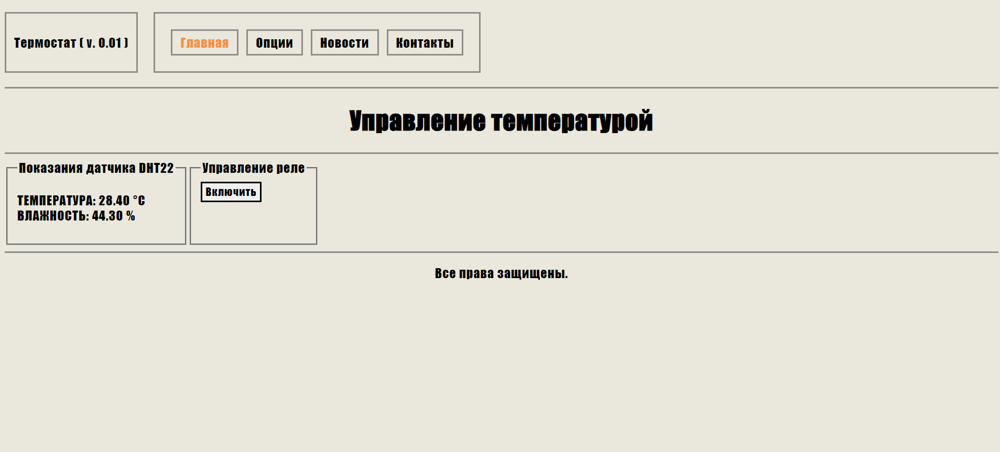
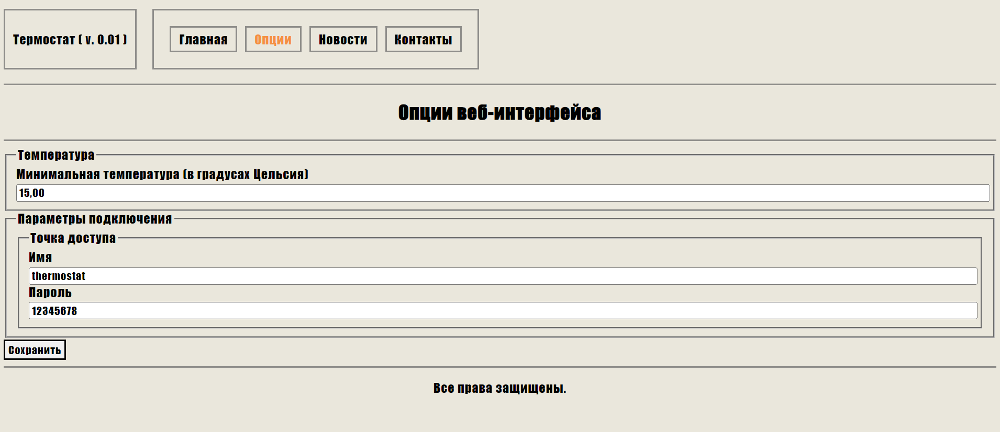
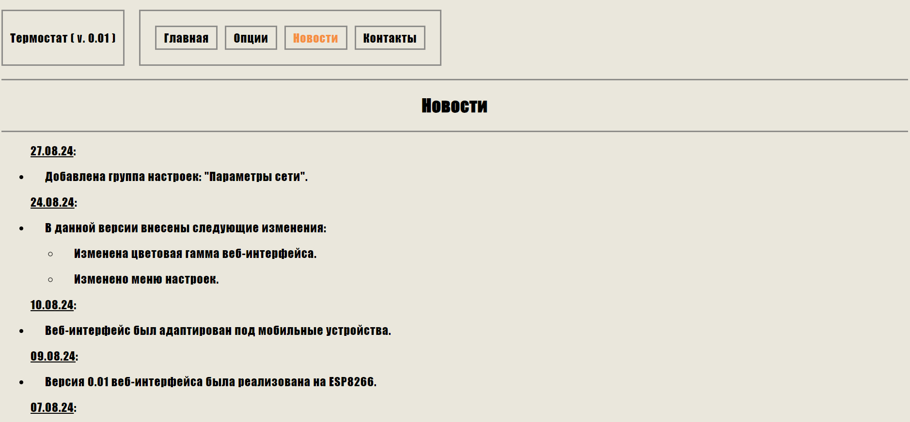
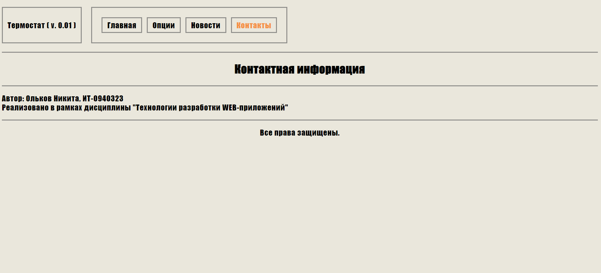

Данный проект создан в рамках дисциплины "Технологии разработки WEB-приложений". 

Автор - студент группы ИТ-0940323, Ольков Никита.

Данный проект представляет собой устройство, созданное на базе микроконтроллера ESP8266. Оснащено датчиком температуры и влажности DHT22 и реле.
Взаимодействие пользователя с устройством производится в режиме точки доступа WiFi.

Управление устройством и вывод показателей реализованы с помощью веб-интерфейса. 

В нем реализовано:
  1) управление реле
  2) вывод показаний датчика
  3) меню настроек с возможностью изменения минимального порога температуры, а также настроек точки доступа (имя сети WiFi, пароль)

